# Night Engine - Product Requirements Document

## 1. Introduction

- **Project Idea:** Night Engine is a C# game engine built on SDL3, designed to provide a "batteries-included" development experience. It features a Love2D-inspired API for its foundational framework (`Night.Framework`), with plans for a more opinionated, higher-level engine (`Night.Engine`) to be built on top, offering common game systems. The project also aims to be AI-friendly to assist non-programmers in game development.

- **Problem/Need:** The primary goal is to offer C# developers a streamlined and efficient workflow for game and multimedia development. `Night.Framework` provides direct, SDL3-powered capabilities through a familiar API style, reducing context switching. The future `Night.Engine` will further simplify complex game development tasks.

- **Development Goal:** The current development phase focuses on completing the core features of `Night.Framework` to align with Version 0.1.0 of the API roadmap, providing a robust C# wrapper layer that leverages SDL3's capabilities with an API style reminiscent of Love2D. Future phases will concentrate on building out `Night.Engine` components and subsequent roadmap versions.

## 2. Core Features

### Night.Framework (Love2D-style API)

The following features are largely implemented for the foundational framework:

- **Feature 0: Project Foundation & SDL3 Integration:**

  - **Description:** Established C# project structure for `Night.Engine` (which encompasses `Night.Framework` and placeholders for future engine components) and `Night.SampleGame`. Utilizes `SDL3-CS` C# bindings (via NuGet package) for SDL3 integration. Native SDL3 libraries (for core, image, mixer, ttf) are fetched using the `scripts/sync_sdl3.py` script into `lib/SDL3-Prebuilt/` and included in the `Night.SampleGame` build.

  - **Status:** Mostly Complete (Epics 1 & 8).

- **Feature 1: Window Management (`Night.Window`):**

  - **Description:** Provides capabilities to create, configure (mode, title), and manage the application window (check if open, close). Uses the `Night` namespace with an API style similar to Love2D's `love.window`.

  - **Implemented Functions:** `SetMode`, `SetTitle`, `IsOpen`, `Close`, internal `Shutdown`.

  - **Status:** Largely Complete (Epic 3).

- **Feature 2: Input Handling (Keyboard and Mouse):**

  - **Description:** Allows polling of keyboard (`Night.Keyboard`) and mouse (`Night.Mouse`) states. Mirrors Love2D's `love.keyboard` and `love.mouse` modules.

  - **Implemented Functions:** `Night.Keyboard.IsDown`, `Night.Mouse.IsDown`, `Night.Mouse.GetPosition`. Event `IGame.KeyPressed` is also implemented.

  - **Status:** Largely Complete (Epic 4).

- **Feature 3: 2D Graphics Rendering (`Night.Graphics`):**

  - **Description:** Enables loading images (`.png` via SDL_image) as sprites and drawing them. Includes screen clearing and frame presentation. Leverages SDL_Renderer.

  - **Implemented Functions:** `NewImage` (for sprites), `Draw` (for sprites with transformations), `Clear`, `Present`.

  - **Status:** Largely Complete (Epic 5).

- **Feature 4: Game Loop Structure (`Night.Framework.Run`):**

  - **Description:** Provides a pre-defined game loop managed by `Night.Framework`. Developers implement `Night.IGame` interface callbacks (`Load`, `Update`, `Draw`, `KeyPressed`). Includes delta time calculation and event polling (Quit, KeyDown).

  - **Status:** Largely Complete (Epic 6).

- **Feature 5: Sample Game & Integration Testing (`Night.SampleGame`):**

  - **Description:** A simple platformer game demonstrating the use of `Night.Framework` features. Includes player movement, collision, and basic level structure. Platform message simplification for macOS also completed.

  - **Status:** Implemented (Epics 7 & 9).

### Night.Engine (Future - High-Level Opinionated Systems)

These are planned features for the higher-level engine, to be built upon `Night.Framework`:

- Entity Component System (ECS)

- Scene Management & Scene Graph

- Advanced Asset Management

- Physics Integration (Optional)

- Joystick Manager

## 3. Technical Specifications

- **Primary Language(s):** C# 13 (using .NET 9).

- **Key Frameworks/Libraries:**

  - SDL3 (latest version).

  - C# Bindings: `edwardgushchin/SDL3-CS` (SDL3#) via NuGet package (`SDL3-CS`).

  - Native Binaries:

    - SDL3 (core, SDL_image, SDL_mixer, SDL_ttf) native libraries are fetched by the `scripts/sync_sdl3.py` script into the `lib/SDL3-Prebuilt/` directory.

    - The `Night.SampleGame` project copies these required native binaries (e.g., `SDL3.dll`, `SDL3_image.dll`) to its output directory during build to ensure they are available at runtime.

  - No other external runtime libraries are currently planned for `Night.Framework`.

- **Database:** None.

- **Key APIs/Integrations:** Direct interaction with SDL3 via SDL3-CS C# bindings.

- **Rendering Backend:**

  - `Night.Framework` utilizes SDL_Renderer for 2D graphics operations.

  - Future consideration: Migration to SDL_GPU.

- **Deployment Target:**

  - `Night` (containing `Night.Framework` and `Night.Engine`) is a C# class library (DLL named `Night.dll`).

  - `Night.SampleGame` is a C# console application that consumes `Night`.

- **Target Platforms:** Current focus on Windows, macOS, Linux. Long-term goals include iOS and Android. Console support is a distant stretch goal.

- **High-Level Architectural Approach:**

  - **Night.Framework:** A C# library providing a static API, stylistically similar to Love2D, over the SDL3 native library (via SDL3-CS). Public API primarily within the `Night` C# namespace. This is part of the `Night.dll`.

  - **Night.Engine:** (Future) A C# library providing opinionated game development constructs (e.g., ECS, scene management), using `Night.Framework` for low-level operations. This will also be part of `Night.dll` under the `Night.Engine` namespace.

- **Critical Technical Decisions/Constraints:**

  - The public API of `Night.Framework` aims to mirror the Love2D API where practical and idiomatic for C#.

  - All interactions with SDL3 within `Night.Framework` are through the SDL3-CS bindings. `Night.Engine` will not use SDL3-CS directly.

  - Simplicity and achieving the core Love2D-like developer experience are primary focuses for `Night.Framework`.

## 4. Project Structure

```mermaid
graph TD
    A(any2) --> B(README.md);
    A --> C(LICENSE);
    A --> D(Night.sln);
    A --> E(.editorconfig);
    A --> F(.pre-commit-config.yaml);
    A --> G(docs);
    A --> H(lib);
    A --> I(licenses);
    A --> J(scripts);
    A --> K(src);
    A --> L(.cursor);
    A --> M(.github);
    A --> N(.roo);

    G --> G1(NOTICE.md);
    G --> G2(PRD.md);
    G --> G3(guidelines.md);
    G --> G4(epics);
    G4 --> G4_1(epic1.md);
    G4 --> G4_2(epic2.md);
    G4 --> G4_3(epic3.md);
    G4 --> G4_4(epic4.md);
    G4 --> G4_5(epic5.md);
    G4 --> G4_6(epic6.md);
    G4 --> G4_7("epic7-design.md");
    G4 --> G4_8(epic7.md);
    G4 --> G4_9(epic8.md);
    G4 --> G4_10(epic9.md);
    G --> G5(love2d-api);
    G5 --> G5_1(roadmap.md);
    G5 --> G5_2(modules);
    G5_2 --> G5_2_1(audio.md);
    G5_2 --> G5_2_2(data.md);
    G5_2 --> G5_2_3(event.md);
    G5_2 --> G5_2_4(filesystem.md);
    G5_2 --> G5_2_5(font.md);
    G5_2 --> G5_2_6(graphics.md);
    G5_2 --> G5_2_7(image.md);
    G5_2 --> G5_2_8(joystick.md);
    G5_2 --> G5_2_9(keyboard.md);
    G5_2 --> G5_2_10(love.md);
    G5_2 --> G5_2_11(math.md);
    G5_2 --> G5_2_12(mouse.md);
    G5_2 --> G5_2_13(sound.md);
    G5_2 --> G5_2_14(system.md);
    G5_2 --> G5_2_15(thread.md);
    G5_2 --> G5_2_16(timer.md);
    G5_2 --> G5_2_17(touch.md);
    G5_2 --> G5_2_18(video.md);
    G5_2 --> G5_2_19(window.md);

    J --> J1(sync_sdl3.py);

    K --> K1(src/Night);
    K1 --> K1_1(FrameworkLoop.cs);
    K1 --> K1_2(Night.csproj);
    K1 --> K1_3(Types.cs);
    K1 --> K1_4(Engine);
    K1_4 --> K1_4_1(.gitkeep);
    K1 --> K1_M_Graphics(Graphics/);
    K1_M_Graphics --> K1_M_G_Graphics_cs(Graphics.cs);
    K1 --> K1_M_Window(Window/);
    K1_M_Window --> K1_M_W_Window_cs(Window.cs);
    K1 --> K1_6(Utilities);
    K1_6 --> K1_6_1(.gitkeep);
    K1 --> K1_7(bin);
    K1 --> K1_8(obj);

    K --> K2(Night.SampleGame);
    K2 --> K2_1(Night.SampleGame.csproj);
    K2 --> K2_2(Player.cs);
    K2 --> K2_3(Program.cs);
    K2 --> K2_4(Samples);
    K2_4 --> K2_4_1(Platformer.cs);
    K2 --> K2_5(assets);
    K2_5 --> K2_5_1(images);
    K2_5_1 --> K2_5_1_1(pixel_green.pixi);
    K2_5_1 --> K2_5_1_2(player_sprite_blue_32x64.aseprite);
    K2 --> K2_6(bin);
    K2 --> K2_7(obj);

    M --> M1(CODEOWNERS);
    M --> M2(copilot-instructions.md);
    M --> M3(dependabot.yml);
    M --> M4(deactivated);
    M4 --> M4_1(build-sdl3.yml);
    M4 --> M4_2(ci.yml);
    M4 --> M4_3(codeql.yml);
    M4 --> M4_4(dependency-review.yml);
    M4 --> M4_5(release.yml);
    M4 --> M4_6(scorecard.yml);
    M --> M5(scripts);
```

- `/project`: Project documentation (PRD, operational guidelines, epics, API mapping, etc.).

- `/docs`: DocFx document generation files.

- `/lib`: Contains `SDL3-Prebuilt/` populated by `sync_sdl3.py` and potentially other third-party libraries.

- `/scripts`: Utility scripts for the project (e.g., `sync_sdl3.py`).

- `/src`: Contains all C# source code.

  - `/src/Night`: C# class library project for `Night` Framework and future `Night.Engine` components. This project references the `SDL3-CS` NuGet package and produces `Night.dll`.

    - `Night.csproj`: MSBuild project file.

    - `FrameworkLoop.cs`: Manages the main game loop (`Night.Framework.Run()`) and event polling.

    - `Types.cs`: Defines core data types and interfaces (e.g., `Night.Color`, `Night.KeyCode`, `Night.KeySymbol`, `Night.Sprite`, `Night.IGame`, `Night.MouseButton`, `Night.Rectangle`).

    - Module directories (e.g., `/Graphics/`, `/Window/`): Contain individual C# files for each Love2D-like framework module (e.g., `Graphics.cs`, `Window.cs`). These primarily contain static classes within the `Night` namespace or sub-namespaces like `Night.Graphics`.

    - `/Engine/`: Directory for future high-level engine components, which will reside in the `Night.Engine` namespace. Contains `.gitkeep`.

    - `/Utilities/`: Placeholder for utility classes. Contains `.gitkeep`.

  - `/src/SampleGame`: C# application project demonstrating the use of `Night` Framework.

    - `SampleGame.csproj`: MSBuild project file. References `Night` (the `Night.dll`) and includes native SDL binary deployment logic.

    - `Program.cs`: Main entry point and `IGame` implementation for the sample game.

    - `Player.cs`: Player logic for the sample platformer game.

    - `/assets`: Game assets (images, etc.) for the sample game.

  - `/tests/`: C# application project for testing `Night` Framework and future `Night.Engine` components. This will be a custom framework

    - `NightTest.csproj`: MSBuild project file.

    - `Program.cs`: Main entry point and `IGame` implementation for the test game.

    - `/assets`: Game assets (images, etc.) for the sample game.

    - `TestRunner.cs`: Manages and reports the status of various tests within NightTest

- `Night.sln`: Visual Studio solution file.

- `README.md`: Main project readme.

- `.github/`: GitHub-specific files including active `dependabot.yml` and `CODEOWNERS`, plus deactivated workflows.

- `.editorconfig`, `.pre-commit-config.yaml`: Code style and pre-commit hook configurations.

## 5. File Descriptions

- **`Night.sln`**: Visual Studio Solution file grouping `Night.Engine` and `Night.SampleGame` projects. Defines project paths and configurations.

- **`src/Night/Night.csproj`**: The MSBuild project file for the main `Night` C# class library. This library, `Night.dll`, includes the `Night` namespace (for the Love2D-like framework) and the `Night.Engine` namespace (for future higher-level engine features).

- **`src/Night.SampleGame/Night.SampleGame.csproj`**: MSBuild project file for the sample game application. References `Night` (the `Night.dll`) and includes steps to copy native SDL3 binaries (from `lib/SDL3-Prebuilt/`) to the output directory.

## 6. Future Considerations (Post Version 0.1.0)

**Out of Scope for Version 0.1.0 (Night.Framework):** (Based on `roadmap.md` and existing "Out of Scope" items from `project/love2d-api/modules/*.md` for modules beyond 0.1.0, and previous PRD version)

- **Full Love2D API Parity:** Modules and features beyond those specified for v0.1.0 in `roadmap.md`. This includes:

  - `love.audio` and `love.sound` (Audio playback, recording, effects, decoding).

  - `love.joystick` (Gamepad/joystick support).

  - `love.event` (User-managed event queue, custom event pushing beyond basic callbacks).

  - `love.font` (Advanced font rendering, rasterizers beyond basic text if not part of Graphics 0.1.0).

  - `love.thread` (User-managed threading abstractions).

  - `love.touch` (Touchscreen input).

  - `love.video` (Video playback).

  - `love.data` (Compression, encoding, hashing beyond standard .NET libraries if specific Love2D behavior is needed).

  - `love.math` (Advanced math functions like noise, triangulation, Bezier curves beyond System.Math).

  - `love.system` (Clipboard, power info, openURL, etc., beyond basic OS info).

- **Advanced Rendering in Night.Framework:** Custom shaders, 3D graphics, complex lighting, particle systems beyond what SDL_Renderer offers for 2D and what's planned for 0.1.0 graphics.

- **Game Packaging/Distribution Tools, Editor/GUI Tools:** Not included.

**Potential Future Enhancements (Post-0.1.0, or as part of Night.Engine):**

- **Night.Engine Core:**

  - Entity Component System (ECS) Architecture.

  - Scene Management & Scene Graph.

  - Advanced Game State Management.

- **Expanded Night.Framework Modules (as per roadmap.md versions > 0.1.0):**

  - Audio Module (`Night.Audio`)

  - Font Rendering (`Night.Font`)

  - Expanded Input (`Night.Joystick`, `Night.Touch`)

  - More Graphics Primitives & Features in `Night.Graphics` (shapes, basic shader integration, camera).

  - Filesystem Abstraction (`Night.Filesystem` - beyond basic 0.1.0 needs).

  - Timing Module (`Night.Timer` - beyond basic 0.1.0 needs).

- **Tooling & Developer Experience:**

  - Dear ImGui Integration.

  - Quake-Style Debug Console.

  - Lua Scripting Interface.

- **General:**

  - Improved Error Handling & Debugging Tools.

  - Performance Profiling and Optimization.

  - Expanded Platform Support Verification (Android, iOS).

  - Community Building: Tutorials, more examples, comprehensive documentation.
